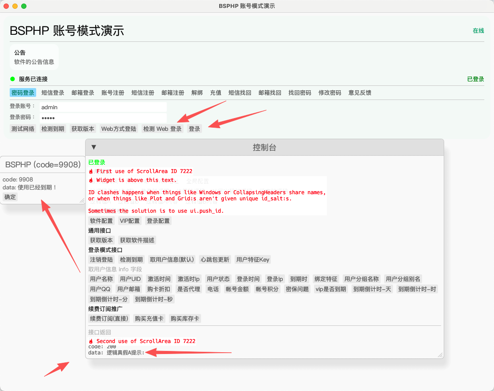
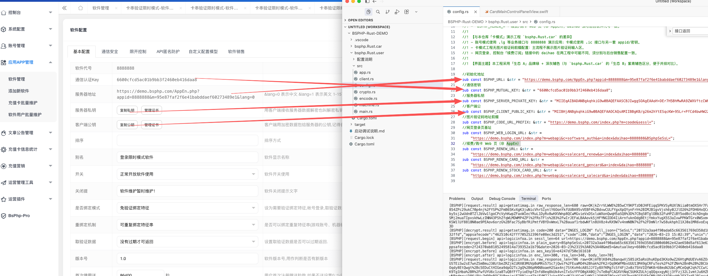
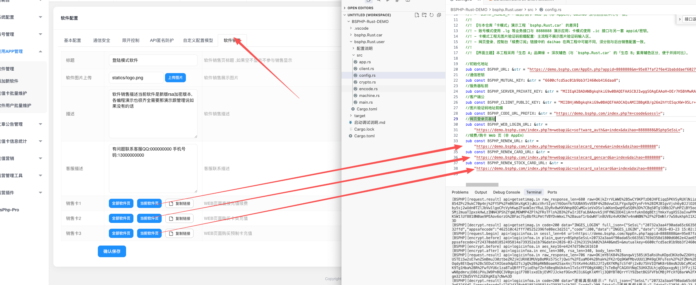
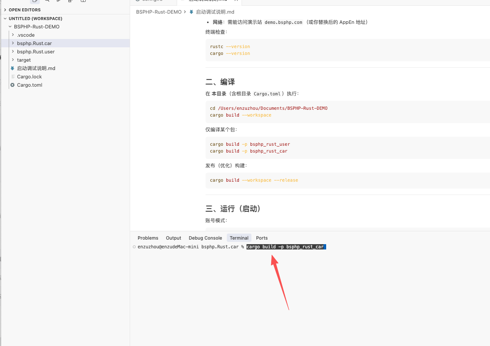

# BSPHP Rust Demo


本目录包含两个独立的 Rust 示例工程，逻辑与界面流程参考 macOS/iOS 演示工程中的 **卡模式** 与 **用户账号模式**

[BSPHP](https://www.bsphp.com) 为软件会员/订阅与授权管理方案，支持账号密码注册、充值卡激活等多种方式。

---


## 简体中文

### 请先阅读说明再操作

开始前请先阅读 `启动调试说明.md`，再进行编译、运行、调试和后台配置。

- 账号模式目录：`bsphp.Rust.user`
- 卡模式目录：`bsphp.Rust.car`

### 快速启动

```bash
cargo build --workspace
cargo run -p bsphp_rust_user
cargo run -p bsphp_rust_car
```

### 配置/操作说明图片

#### 账号模式（`bsphp.Rust.user`）





#### 卡模式（`bsphp.Rust.car`）



---

## 繁體中文

### 請先閱讀說明再操作

開始前請先閱讀 `启动调试说明.md`，再進行編譯、執行、除錯與後台配置。

- 帳號模式目錄：`bsphp.Rust.user`
- 卡模式目錄：`bsphp.Rust.car`

### 快速啟動

```bash
cargo build --workspace
cargo run -p bsphp_rust_user
cargo run -p bsphp_rust_car
```

### 配置/操作說明圖片

#### 帳號模式（`bsphp.Rust.user`）


#### 卡模式（`bsphp.Rust.car`）


---

## English

### Read instructions before operating

Before building/running/debugging, please read `启动调试说明.md` first.

- User mode folder: `bsphp.Rust.user`
- Card mode folder: `bsphp.Rust.car`

### Quick Start

```bash
cargo build --workspace
cargo run -p bsphp_rust_user
cargo run -p bsphp_rust_car
```

### Configuration / Operation Screenshots

#### User Mode (`bsphp.Rust.user`)


#### Card Mode (`bsphp.Rust.car`)


